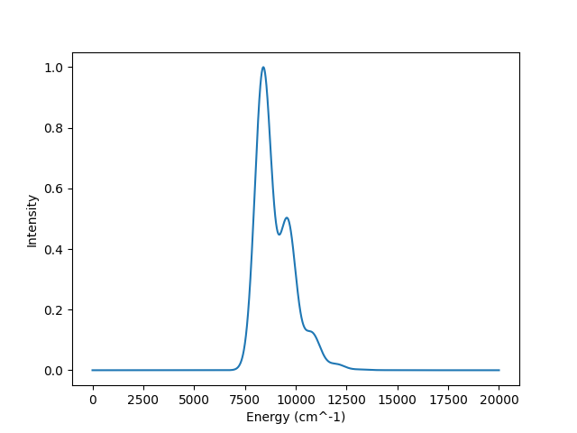

.. currentmodule:: quantumspectra_2024.models

MLJ Model
=====================

The MLJ model is a semiclassical model for absorption spectra.
It expected a high-energy and low-energy mode.

This model represents a system with two states, a ground state and an excited state.
It also expects two modes. An absorption spectrum is calculation with a summation.

More details on the calculation process can be found in the :ref:`MLJ Computation Docs <mlj-calculation>`.

Model Name
----------------

In **config files**, this Model is named ``mlj``. This can be specified in ``your-config.toml`` with:

.. code-block:: toml

    model.name = "two-state"

In the **package**, this Model is named ``MLJModel``. This can be imported with:

.. code-block:: python

    from quantumspectra_2024.absorption import MLJModel

Parameters
----------------

All Models have a mixture of required and optional parameters.
For further explanation and expected values, see the :ref:`MLJ Computation Docs <mlj-calculation>`.

Model Parameters
^^^^^^^^^^^^^^^^^^^^

.. note:: 
    All MLJ Models require these parameters on initialization.

This static integer parameter defines the size of the calculation:

    .. autoattribute:: MLJModel.basis_size

These scalar parameters are used in the calculation:

    .. autoattribute:: MLJModel.temperature_kelvin
    
    .. autoattribute:: MLJModel.energy_gap
    
    .. autoattribute:: MLJModel.disorder_meV

These vector parameters are used in the calculation, and define mode parameters.
They should correspond to the number of modes in the calculation, and thus have two values.
Each value should correspond to a high-energy and low-energy mode (order doesn't matter).

    .. autoattribute:: MLJModel.mode_frequencies
    
    .. autoattribute:: MLJModel.mode_couplings

General Parameters
^^^^^^^^^^^^^^^^^^^^

All Models have optional parameters to specify the range of their generated spectrum.
By default, all Models generate 2,001 points between 0 and 20,000 wavenumbers.

    .. autoattribute:: MLJModel.start_energy

    .. autoattribute:: MLJModel.end_energy

    .. autoattribute:: MLJModel.num_points

Examples
----------------

These examples display both types of usage for this class.
Both use the same "default" parameters that appear in the given sample config.

Both of these methods will produce the following absorption spectrum:

CLI Usage
^^^^^^^^^^^^^^^^^^^^

#. First, create a config file ``your-config.toml`` that includes the required specifications, and these contents:

    .. code-block:: toml

        model.name = "two-state"

        model.temperature_kelvin = 300
        model.energy_gap = 8000
        model.disorder_meV = 0

        model.basis_size = 20

        model.mode_frequencies = [1200, 100]
        model.mode_couplings = [0.7, 2.0]

    More information on Config files can be found on the :doc:`../cli/config` page.

#. Then, run the absorption spectrum command with the path to your config file.

    .. code-block:: bash

        qs_2024 path/to/your-config.toml

    This will save the generated absorption spectrum to the specified output file.

Package Usage
^^^^^^^^^^^^^^^^^^^^

#. First, import the Model.

    .. code-block:: python

        from quantumspectra_2024.models import MLJModel

#. Create an instance of the model with the desired parameters.

    .. code-block:: python

        model = TwoStateModel(
            temperature_kelvin=300,
            energy_gap=8000,
            disorder_meV=0,
            basis_size=20,
            mode_frequencies=[1200, 100],
            mode_couplings=[0.7, 2.0]
        )

#. Run the ``get_absorption`` method to generate the absorption spectrum.

    .. warning::

        This is the cpu (or gpu)-intensive part of the process.
        Only run this method when you are ready to generate the absorption spectrum.

    .. code-block:: python

        spectrum = model.get_absorption()

    This will return an ``AbsorptionSpectrum`` instance to the ``spectrum`` variable.
    Details on the ``AbsorptionSpectrum`` class can be found in the :doc:`Absorption Spectrum Docs <../package/absorption_spectrum>`.

    Accessing spectrum data:

    .. code-block:: python

        x, y = spectrum.energies, spectrum.intensities
        print(x)
        print(y)

    Saving spectrum data:

    .. code-block:: python

        spectrum.save_data("path/to/output/file.csv")
        spectrum.save_plot("path/to/output/plot.png")

Full Class
----------------

.. autoclass:: MLJModel
    :members: get_absorption, get_low_high_frequency_modes, apply_electric_field, _verify_modes
