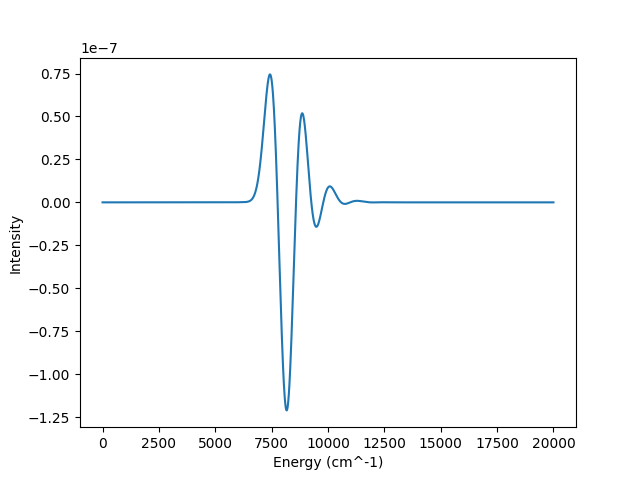

.. currentmodule:: quantumspectra_2024.absorption

Stark Model
==============================

The stark model is a general implementation for the impact of an electric field applied to any other ``Model``.

All other ``Model`` classes have an implemented ``apply_electric_field()`` method. 
This model uses this method to calculate a new absorption spectrum from the effects of an electric field on the submodel's absorption spectrum.

More details on the implementation of the Stark effect can be found in the :ref:`Stark Computation Docs <stark-electric-field-calculation>`.

This model requires a **submodel** to be passed in as an argument. The submodel is the model that will be used to calculate the absorption spectrum.

Model Name
----------------
In **config files**, this Model is named ``stark``. This can be specified in ``your-config.toml`` with:

.. code-block:: toml

    model.name = "stark"

In this **package**, this Model is named ``StarkModel``. This can be imported with:

.. code-block:: python

    from quantumspectra_2024.absorption.stark import StarkModel

Parameters
----------------

All Models have a mixture of required and optional parameters.
For further explanation and expected values, see the :ref:`Stark Computation Docs <stark-electric-field-calculation>`.

Required Parameters
^^^^^^^^^^^^^^^^^^^^

.. note:: 
    All Stark Models require these parameters on initialization.

An initialized neutral submodel used to calculate the absorption spectrum:

.. autosummary:: 

    StarkModel.neutral_submodel

.. warning:: 

    The submodel must be initialized before the StarkModel. 
    The submodel should represent **neutral** conditions.

These scalar paramters describe the effect of the electric field:

.. autosummary:: 

    StarkModel.positive_field_strength
    StarkModel.positive_field_sum_percent

These scalar parameters describe the nature of the electric field:

.. autosummary:: 

    StarkModel.field_delta_dipole
    StarkModel.field_delta_polarizability

Optional Parameters
^^^^^^^^^^^^^^^^^^^^

All Models have optional parameters to specify the range of their generated spectrum.
By default, all Models generate 2,001 points between 0 and 20,000 wavenumbers.
This takes priority over the submodel's default range.

.. autosummary:: 
    
    TwoStateModel.start_energy
    TwoStateModel.end_energy
    TwoStateModel.num_points

Examples
----------------

These examples display both types of usage for this class.
Both use the same "default" parameters that appear in the given sample config.

Both of these methods will produce the following absorption spectrum:

CLI Usage
^^^^^^^^^^^^^^^^^^^^

#. First, create a config file ``your-config.toml`` that includes the required specifications, and these contents:

    .. code-block:: toml

        model.name = "stark"

        model.positive_field_strength = 0.01
        model.positive_field_sum_percent = 0.5

        model.field_delta_dipole = 38
        model.field_delta_polarizability = 1000

    Because the Stark Model requires a submodel, also include the submodel's config:

    .. code-block:: toml

        model.neutral_submodel.name = "two_state"

        model.neutral_submodel.temperature_kelvin = 300
        model.neutral_submodel.broadening = 200

        model.neutral_submodel.transfer_integral = 100
        model.neutral_submodel.energy_gap = 8000

        model.neutral_submodel.mode_basis_sets = [20, 200]
        model.neutral_submodel.mode_frequencies = [1200, 100]
        model.neutral_submodel.mode_couplings = [0.7, 2.0]

    More information on Config files can be found on the :doc:`../cli/config` page.

#. Then, run the absorption spectrum command with the path to your config file.

    .. code-block:: bash

        qs_2024 path/to/your-config.toml

    This will save the generated absorption spectrum to the specified output file.

Package Usage
^^^^^^^^^^^^^^^^^^^^

#. First, import the Model, and the desired submodel.

    .. code-block:: python

        from quantumspectra_2024.absorption import StarkModel
        from quantumspectra_2024.absorption import TwoStateModel # or any other submodel

#. Create an instance of the submodel with the desired parameters.

    .. warning::

        Because the submodel is used as a parameter in the Stark model, this must be initialized *first*.

    .. code-block:: python

        submodel = TwoStateModel(
            temperature_kelvin=300,
            broadening=200,
            transfer_integral=100,
            energy_gap=8000,
            mode_basis_sets=[20, 200],
            mode_frequencies=[1200, 100],
            mode_couplings=[0.7, 2.0]
        ) # or any other submodel

#. Create an instance of the Stark model with the desired parameters.

    .. code-block:: python

        model = StarkModel(
            neutral_submodel = submodel,
            positive_field_strength = 0.01,
            positive_field_sum_percent = 0.5,
            field_delta_dipole = 38,
            field_delta_polarizability = 1000,
        )

#. Run the ``get_absorption`` method to generate the absorption spectrum.

    .. warning::

        This is the cpu (or gpu)-intensive part of the process.
        Only run this method when you are ready to generate the absorption spectrum.

    .. code-block:: python

        spectrum = model.get_absorption()

    This will return an ``AbsorptionSpectrum`` instance to the ``spectrum`` variable.
    Details on the ``AbsorptionSpectrum`` class can be found in the :doc:`Absorption Spectrum Docs <../package/absorption_spectrum>`.

    Accessing spectrum data:

    .. code-block:: python

        x, y = spectrum.energies, spectrum.intensities
        print(x)
        print(y)

    Saving spectrum data:

    .. code-block:: python

        spectrum.save_data("path/to/output/file.csv")
        spectrum.save_plot("path/to/output/plot.png")

Full Class
----------------

.. autoclass:: StarkModel
    :members: get_absorption, get_neutral_submodel, get_charged_submodel
