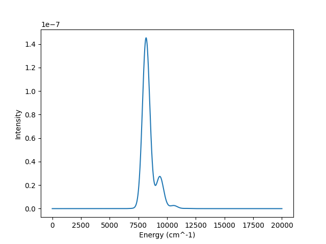

.. currentmodule:: quantumspectra_2024.absorption

Two-State Model
======================================================================

The two-state multimodal model is a quantum mechanical model for absorption spectra.
It expects two states and any number of modes.

This model represents a system with two states, a ground state and an excited state. 
The absorption spectrum is generated by first expanding a vibronic hamiltonian.
Then, the hamiltonian is diagonalized, and the eigenvalues and eigenvectors are used to calculate the spectrum peaks.
Finally, the peaks are broadened with a linear combination of gaussian distributions, returning the absorption spectrum.

More details on the vibronic hamiltonian portion of this process can be seen in the :ref:`Two-State Computation Docs <two-state-model-computation>`.

More details on the peak points and peak broadening portion of this process can be seen in the :ref:`Hamiltonian Computation Docs <hamiltonian-model-computation>`.

Model Name
----------------
In **config files**, this Model is named ``two-state``. This can be specified in ``your-config.toml`` with:

.. code-block:: toml
    
    model.name = "two-state"

In the **package**, this Model is named ``TwoStateModel``. This can be imported with:

.. code-block:: python

    from quantumspectra_2024.absorption import TwoStateModel

Parameters
----------------

All Models have a mixture of required and optional parameters.
For further explanation and expected values, see the :ref:`Two-State Computation Docs <two-state-model-computation>`.

Required Parameters
^^^^^^^^^^^^^^^^^^^^

.. note::
    All Two-State Models require these parameters on initialization.

These scalar parameters are used in the broadening process:

.. autosummary:: 

    TwoStateModel.broadening
    TwoStateModel.temperature_kelvin

These scalar parameters are used in the vibronic hamiltonian expansion:

.. autosummary::
    
    TwoStateModel.transfer_integral
    TwoStateModel.energy_gap

These vectory parameters are used in the vibronic hamiltonian expansion.
They must be inputted as arrays, with one value for each mode:

.. autosummary:: 
    
    TwoStateModel.mode_basis_sets
    TwoStateModel.mode_frequencies
    TwoStateModel.mode_couplings

Optional Parameters
^^^^^^^^^^^^^^^^^^^^

All Models have optional parameters to specify the range of their generated spectrum.
By default, all Models generate 2,001 points between 0 and 20,000 wavenumbers.

.. autosummary:: 
    
    TwoStateModel.start_energy
    TwoStateModel.end_energy
    TwoStateModel.num_points

Examples
----------------

These examples display both types of usage for this class.
Both use the same "default" parameters that appear in the given sample config.

Both of these methods will produce the following absorption spectrum:

CLI Usage
^^^^^^^^^^^^^^^^^^^^

#. First, create a config file ``your-config.toml`` that includes the required specifications, and these contents:

    .. code-block:: toml

        model.name = "two-state"

        model.temperature_kelvin = 300
        model.broadening = 200

        model.transfer_integral = 100
        model.energy_gap = 8000

        model.mode_basis_sets = [20, 200]
        model.mode_frequencies = [1200, 100]
        model.mode_couplings = [0.7, 2.0]

#. Then, run the absorption spectrum command with the path to your config file.

    .. code-block:: bash

        qs_2024 path/to/your-config.toml

    This will save the generated absorption spectrum to the specified output file.

Package Usage
^^^^^^^^^^^^^^^^^^^^

#. First, import the Model.

    .. code-block:: python

        from quantumspectra_2024.absorption import TwoStateModel

#. Create an instance of the model with the desired parameters.

    .. code-block:: python

        model = TwoStateModel(
            temperature_kelvin=300,
            broadening=200,
            transfer_integral=100,
            energy_gap=8000,
            mode_basis_sets=[20, 200],
            mode_frequencies=[1200, 100],
            mode_couplings=[0.7, 2.0]
        )

#. Run the ``get_absorption`` method to generate the absorption spectrum.

    .. warning::

        This is the cpu (or gpu)-intensive part of the process.
        Only run this method when you are ready to generate the absorption spectrum.

    .. code-block:: python

        spectrum = model.get_absorption()

    This will return an ``AbsorptionSpectrum`` instance to the ``spectrum`` variable.
    Details on the ``AbsorptionSpectrum`` class can be found in the :doc:`Absorption Spectrum Docs <../package/absorption_spectrum>`.

    Accessing spectrum data:

    .. code-block:: python

        x, y = spectrum.energies, spectrum.intensities
        print(x)
        print(y)

    Saving spectrum data:

    .. code-block:: python

        spectrum.save_data("path/to/output/file.csv")
        spectrum.save_plot("path/to/output/plot.png")

Full Class
----------------

.. autoclass:: TwoStateModel
    :members: get_absorption, get_hamiltonian, apply_electric_field
